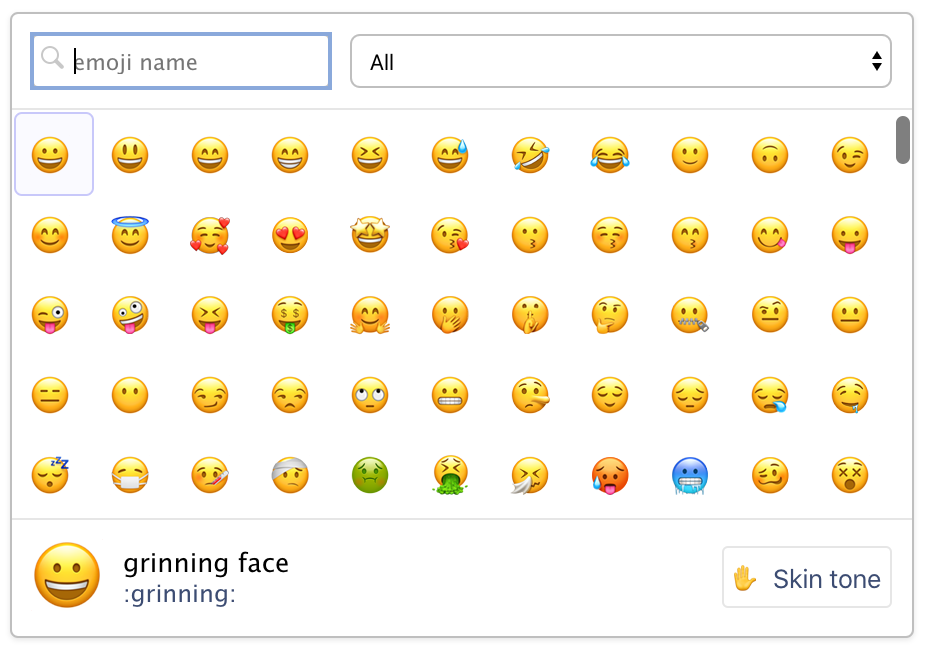
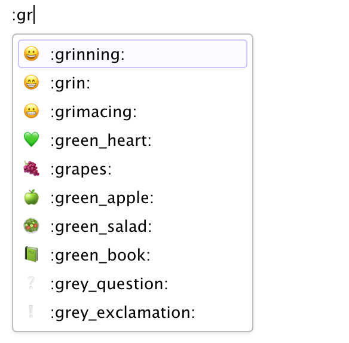

<!-- -*- mode: gfm -*- -->

Visual mode supports editing all of Pandoc markdown.
Standard formatting commands (headings, bold, italic, etc.) work just the way they do in a conventional word processor.

See the [Using the Editor](intro#using-the-editor) section for more details on how to access core editing commands.
Note also that you can access all editing commands via [keyboard shortcuts](shortcuts).

Editing of links, images, blockquotes, lists, tables, etc. is also available, as is the ability to specify Pandoc attributes and insert special characters and emojis.
[This article](content) describes how to use these features.

## Editing Tables

You can insert a table using the **Table** menu.
You can then use either the main menu or a context menu to insert and delete table rows and columns:

Note that if you select multiple rows or columns the insert or delete command will behave accordingly.
For example, to insert 2 rows, first select 2 rows then use the insert command.

When you make a selection of multiple rows and/or columns as illustrated above, you can also copy and paste groups of cells within the table.

## Editing Lists

As described above, you can create a new list by just typing `-` or `1.` at the beginning of an empty paragraph.
To add items to the list, just press **Enter** within a list item.
To exit the list, press **Enter** within an empty list item.

While this covers many simple list editing tasks, there is a variety of other actions you may want to take within lists, including creating nested lists and adding paragraphs or code blocks to an exiting list item.
From an empty list item (pictured at left), the following keyboard gestures can be used to do this:

| **Empty Item** (*enter to exit list*)                                                               | **Tab** (*add sublist*)                                                                                | **Backspace** (*add block*)                                                                          |
|-----------------------------------------------------------------------------------------------------|--------------------------------------------------------------------------------------------------------|------------------------------------------------------------------------------------------------------|
|  |  |  |

You can also use **Shift+Tab** to lift a list item into the previous level.

### Tight Lists

Markdown distinguishes between normal and *tight* lists, where tight lists have less vertical spacing between items.
In markdown source code, you designate a tight list by having no empty lines between your list items.

Visual mode creates normal lists by default (you can change this behavior via [Editor Options](options)).
You can toggle between normal and tight lists using the <kbd>⌥⌘ 9</kbd> keyboard shortcut.
You can also change the list type using the **Format -\> Edit Attributes** dialog (also accessible via the <kbd>F4</kbd> shortcut).
If you have existing tight lists in your markdown source files, they will remain so within the visual editor.

## Pandoc Attributes

Several of Pandoc's block types (e.g. headings, code blocks, and divs) enable you to specify a set of [custom attributes](https://pandoc.org/MANUAL.html#heading-identifiers).
Attributes include IDs and class names, as well as arbitrary key-value pairs that are passed through to output formats (e.g. as attributes for HTML tags).
For these block types, an edit button will appear at the the top right when your cursor is within the block:

Note that any ID as well as the first class specified within the attributes are also displayed.
Click the edit button or use the <kbd>F4</kbd> keyboard shortcut to edit the attributes.

## Special Characters

### Hard Line Breaks

You can insert a [hard line break](https://practicaltypography.com/hard-line-breaks.html) using the **Insert -\> Special Characters -\> Hard Line Break** command or via the <kbd>⇧ Enter</kbd> keyboard shortcut.

### Non-Breaking Spaces

You can insert a [non-breaking space](https://en.wikipedia.org/wiki/Non-breaking_space) using the **Insert -\> Special Characters -\> Non-Breaking Space** command or via the <kbd>⌃ Space</kbd> keyboard shortcut.
Non-breaking spaces are displayed with an alternate background color to distinguish them from normal spaces.

A markdown non-breaking space will result in the `&nbsp;` character within HTML output and a `~` character within LaTeX output.

### Emojis

To insert an emoji, you can use either the **Insert** menu or the requisite markdown shortcut plus auto-complete:

| **Insert -\> Special Characters -\> Emoji...** | Markdown Shortcut                               |
|------------------------------------------------|-------------------------------------------------|
|     |  |

For markdown formats that support text representations of emojis (e.g. `:grinning:`), the text version will be written.
For other formats the literal emoji character will be written.
Currently, GitHub Flavored Markdown and Hugo (with `enableEmjoi = true` in the site config) both support text representation of emojis.

### Unicode Symbols

To insert an arbitrary Unicode character, use **Insert -\> Special Characters -\> Unicode...**:

You can search for characters either by name or by entering an explicit Unicode code point (e.g. "U+0420").

### Smart Punctuation

When the Pandoc [`smart`](https://pandoc.org/MANUAL.html#typography) extension is enabled (which it is by default), straight quotes are interpreted as curly quotes, `---` as em-dashes, `--` as en-dashes, and `...` as ellipses.
In addition, non-breaking spaces are inserted after certain abbreviations, such as "Mr."

Visual mode supports these same transformations (so when you type `---` it becomes an em-dash).
If you didn't intend for this transformation to occur just hit backspace and it will be reverted.

## Spell-Checking

When RStudio real time spell-checking is enabled (you can do this using **Spelling** preferences), misspelled words will be underlined as you type:

To resolve a spelling error, right-click on the misspelled word, then either choose an alternate spelling, ignore the word (which applies to the current document only), or add the word to your user dictionary (which applies to all documents).

If you ignore a word by mistake, right-click it again to unignore it.
If you want to edit your personal dictionary, use the **Edit User Dictionary...** button located within **Spelling** preferences.

## Commenting

When reviewing an R Markdown document you often want to provide inline comments with suggested revisions.
This is possible in R Markdown using HTML comments (which are ignored by all output formats).
Visual mode includes a command for inserting HTML comments as well as special highlighting treatment to easily parse out editing comments from surrounding text.

Note that the \# prefix used in the comment is what triggers the special background highlighting.
If you remove the `#` it will still be a valid HTML comment, but just won't be highlighted as shown above.

You can insert an HTML comment using the Comment button on the toolbar or via the <kbd>⇧⌘ C</kbd> keyboard shortcut.
Remember, HTML comments won't show up in rendered output so they are ideal both for review but also for leaving yourself to-do notes within a document.
