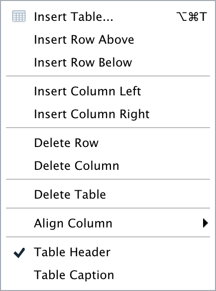

<!-- -*- mode: gfm -*- -->

<h1>Visual R Markdown</h1>

RStudio v1.4 includes an experimental visual markdown editing mode. Highlights of visual mode include:

-   Visual editing for all of Pandoc markdown, including tables, footnotes, citations, divs/spans, definition lists, id/class attributes, equations, TeX, and HTML.

-   Tight integration with source editing (editing location and undo/redo state are preserved when switching between modes).

-   Rich keyboard support. In addition to traditional shortcuts, you can use markdown expressions (e.g. `##`, `**bold**`, etc.) for formatting. If you don't remember all of the keybaord shortcuts, you can also use the catch-all <kbd>⌘ /</kbd> shortcut to insert anything.

?\> Visual mode does not yet incorporate R code editing intelligence (e.g. code completion, auto-indent, keyboard shortcuts etc.) or inline chunk output. As a result, it is currently aimed at composition of longer-form documents rather than interactive data analysis. Additional code editing and execution features will be added in subsequent releases.

## Getting Started

Visual markdown editing is currently only available in the [daily build](https://dailies.rstudio.com) of RStudio. You can download the desktop version of the daily build here:


| Platform            | Download                                                                                                                                                              | Size | SHA-256                                                                                                              |
| :------------------ | :-------------------------------------------------------------------------------------------------------------------------------------------------------------------- | :--- | :------------------------------------------------------------------------------------------------------------------- |
| Windows 10/8/7      | <a href="https://s3.amazonaws.com/rstudio-ide-build/desktop/windows/RStudio-1.4.505.exe"><i class="fa fa-download"></i> RStudio-1.4.505.exe</a>                       | 153M | <span class="sha256" data-sha256="796013703eeba53a7a6c8a84898235765877ee6ba346299fae005d2598d5917a">79601370…</span> |
| MacOS 10.13+        | <a href="https://s3.amazonaws.com/rstudio-ide-build/desktop/macos/RStudio-1.4.509.dmg"><i class="fa fa-download"></i> RStudio-1.4.509.dmg</a>                         | 152M | <span class="sha256" data-sha256="8d70c103e68e00c4c7b9e4b839762947b0f63c8c12f2c3d6b250dea670d0578f">8d70c103…</span> |
| Ubuntu 18/Debian 10 | <a href="https://s3.amazonaws.com/rstudio-ide-build/desktop/bionic/amd64/rstudio-1.4.509-amd64.deb"><i class="fa fa-download"></i> rstudio-1.4.509-amd64.deb</a>      | 114M | <span class="sha256" data-sha256="3f8a7d55ddc9eba0360c50db093a84a8293ba09b2a5364c668c60116c45f3985">3f8a7d55…</span> |
| Fedora 28/Red Hat 8 | <a href="https://s3.amazonaws.com/rstudio-ide-build/desktop/centos8/x86_64/rstudio-1.4.509-x86_64.rpm"><i class="fa fa-download"></i> rstudio-1.4.509-x86\_64.rpm</a> | 131M | <span class="sha256" data-sha256="3e1dffb51fa4c273ce4e037918778ef71770fb1369faec74e53919d3316c8757">3e1dffb5…</span> |


For other desktop platforms or RStudio Server, please visit <https://dailies.rstudio.com>.

?\> Daily builds are intended for testing purposes, and are not recommended for general use.

### Enabling Visual Mode

Visual markdown editing is not available by default. To enable it, use **Preferences -\> R Markdown**:


Once you've enabled visual editing, you can switch between source and visual mode using the button at the top-right of the document toolbar (you can also switch using the <kbd>⌃⇧ F8</kbd> keyboard shortcut):


## Editing Basics

### Keyboard Shortcuts

There are keyboard shortcuts for all basic editing tasks. Visual mode supports both traditional keyboard shortcuts (e.g. <kbd>⌘ B</kbd> for bold) as well as markdown shortcuts (using markdown syntax directly). For example, enclose `**bold**` text in asterisks or type `##` and press space to create a second level heading. Here are some of the most commonly used shortcuts:

| Command      | Keyboard Shortcut | Markdown Shortcut |
|--------------|:-----------------:|:-----------------:|
| Bold         |   <kbd>⌘ B</kbd>  |     `**bold**`    |
| Italic       |   <kbd>⌘ I</kbd>  |     `*italic*`    |
| Code         |   <kbd>⌘ D</kbd>  |    `` `code` ``   |
| Link         |   <kbd>⌘ K</kbd>  |      `<href>`     |
| Heading 1    |  <kbd>⌥⌘ 1</kbd>  |        `#`        |
| Heading 2    |  <kbd>⌥⌘ 2</kbd>  |        `##`       |
| Heading 3    |  <kbd>⌥⌘ 3</kbd>  |       `###`       |
| R Code Chunk |  <kbd>⌥⌘ I</kbd>  |  ```` ```{r} ```` |

See the [keyboard shortcuts](shortcuts) article for a complete list of all shortcuts.

### Insert Anything

You can also use the catch-all <kbd>⌘ /</kbd> shortcut to insert just about anything. Just execute the shortcut then type what you want to insert. For example:


If you are at the beginning of a line (as displayed above) you can also enter plain `/` to invoke the shortcut.

### Editor Toolbar

The editor toolbar includes buttons for the most commonly used formatting commands:


Additional commands are available on the **Format**, **Insert**, and **Table** menus:

| Format                                     | Insert                                     | Table                                     |
|--------------------------------------------|--------------------------------------------|-------------------------------------------|
|  |  |  |

## Learning More

Check out the following articles to learn more about visual markdown editing:

-   [Using Visual Mode](using) goes into more depth on visual editor support for text formatting, tables, images, footnotes, citations, embedded code, equations, HTML & Tex, and more.

-   [Markdown Formats](markdown) describes how the visual editor parses and writes markdown, and also includes some tips for usage with [Bookdown](markdown#bookdown-extensions) and [Hugo](markdown#hugo-markdown).

-   [Editing Shortcuts](shortcuts) documents the two types of shortcuts you can use with the editor: standard keyboard shortcuts and markdown shortcuts.

-   [Editor Options](options) enumerates the various ways you can configure the behavior of the editor (font size, display width, markdown output, etc.).

-   [Additional Topics](additional) discusses various other features including [using CSS](advanced#using-css) within HTML documents.

Thanks for trying out the visual editor! If you encounter problems or want to suggest features, please let us know at <https://github.com/rstudio/rstudio/issues/new/choose>.
